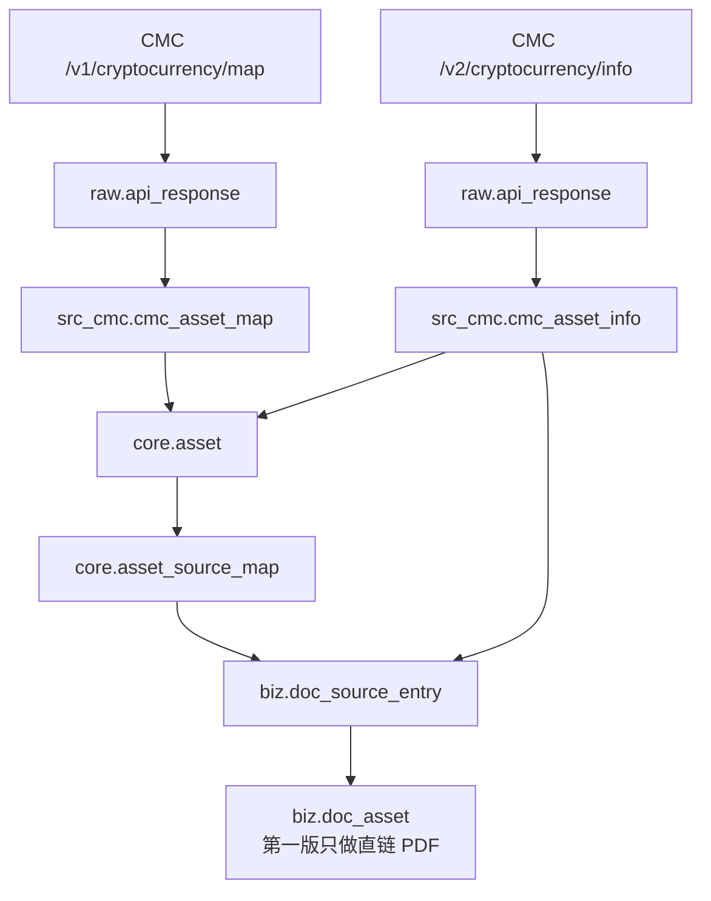

# 当前项目单页流程图版（2026-07-30）

## 一句话理解

这套系统现在做的事，可以压缩成一句话：

> 先从 CMC 把币种资料采进来，再整理成统一资产，再抽出文档入口，再识别出真正的文档文件。

---

## 单页主流程



---

## 你可以把它理解成 5 层

### 1. 采集层

负责“把 API 数据抓回来”：

- `ingest_cmc_map.py`
- `ingest_cmc_info.py`

结果写到：

- `raw.api_response`
- `src_cmc.cmc_asset_map`
- `src_cmc.cmc_asset_info`

### 2. 来源层

负责“按来源存事实，不混写”：

- `src_cmc.cmc_asset_map`
- `src_cmc.cmc_asset_info`

这里还是 CMC 视角，不是统一资产视角。

### 3. 统一实体层

负责“把来源数据变成统一资产”：

- `refresh_core_assets_from_cmc.py`
- `backfill_core_assets_from_cmc.py`

结果写到：

- `core.asset`
- `core.asset_source_map`

### 4. 文档入口层

负责“把官网 / docs / github 这些入口整理出来”：

- `refresh_doc_source_entries_from_cmc.py`

结果写到：

- `biz.doc_source_entry`

### 5. 文档资产层

负责“把入口变成真正的文档文件候选”：

- `discover_doc_assets_from_entries.py`
- `backfill_doc_assets_from_entries.py`

结果写到：

- `biz.doc_asset`

当前只做第一版：

- 明显 PDF
- 可探测为 PDF 的直链

---

## 现在每张关键表是什么意思

### `src_cmc.cmc_asset_map`

币种清单层。

主要放：

- `cmc_id`
- `symbol`
- `name`
- `slug`
- `platform`

### `src_cmc.cmc_asset_info`

币种详情层。

主要放：

- `description`
- `logo`
- `date_launched`
- `urls`
- `category_hint`

### `core.asset`

统一资产主表。

它不是某个来源的原样数据，而是统一资产实体。

### `core.asset_source_map`

统一资产和来源主键的映射表。

比如：

- 哪个 `asset_id` 对应哪个 `cmc_id`

### `biz.doc_source_entry`

文档入口表。

这里存的是：

- 官网入口
- docs 入口
- github 入口
- medium / other 入口

注意：

这里还不是文档文件本体。

### `biz.doc_asset`

文档文件表。

这里才是真正的：

- PDF
- 白皮书
- 审计文档
- docs 文件

---

## 当前已跑到哪一步

当前数据库里的规模大致是：

- `core.asset = 2205`
- `core.asset_source_map(cmc) = 2205`
- `src_cmc.cmc_asset_info = 605`
- `biz.doc_source_entry = 2016`
- `biz.doc_asset = 7`

这几个数字的意思：

- 统一资产层已经开始成形
- CMC info 还在继续补
- 文档入口已经有一定规模
- 文档资产层刚起步，目前只拿下了部分直链 PDF

---

## 当前最重要的几个脚本

如果你现在只想抓主线，先记这 6 个：

1. `scripts/bin/ingest_cmc_map.py`
2. `scripts/bin/ingest_cmc_info.py`
3. `scripts/bin/backfill_cmc_info.py`
4. `scripts/bin/refresh_core_assets_from_cmc.py`
5. `scripts/bin/refresh_doc_source_entries_from_cmc.py`
6. `scripts/bin/discover_doc_assets_from_entries.py`

记忆顺序就是：

```text
先采集 -> 再统一资产 -> 再抽文档入口 -> 再识别文档文件
```

---

## 当前还没完成的部分

### 1. 多源融合还没开始

还没真正接入：

- CoinGecko
- DefiLlama
- 跨源统一映射

### 2. 文档发现还只是第一版

现在只做：

- 直链 PDF

还没做：

- 官网 HTML 深入分析
- GitHub 仓库继续找白皮书
- Docs 站点继续追踪
- AI 多跳发现

### 3. 文档下载 / 哈希 / 同步还没接完

`biz.doc_asset` 现在只是“发现到了文件候选”。

还没完整接上：

- 下载文件
- 计算哈希
- 存储路径
- 上传知识库
- 更新 `parse_status / sync_status`

---

## 你现在看这套项目时，最简单的脑内地图

只记下面这 4 句就够了：

1. `CMC map` 管“币种清单”
2. `CMC info` 管“币种详情和 URL”
3. `core.asset` 管“统一资产”
4. `doc_source_entry -> doc_asset` 管“资料入口到文档文件”

再缩成最后一句：

```text
先拿币 -> 再补详情 -> 再变统一资产 -> 再找文档
```

